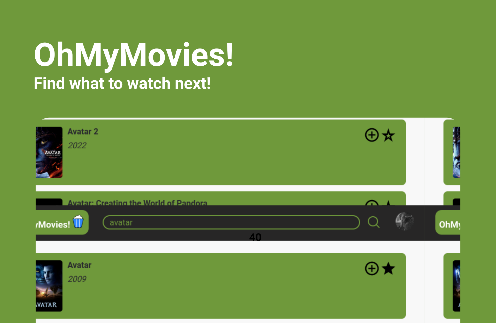

  

# 💻 About

Oh My Movies is a movie search service build to help you to find out what to watch next. It uses the [TMDB Api](https://www.themoviedb.org/documentation/api) to gather all information that you might need to build your next film list.

Don't have time to watch right now? No problem! You can save the movies that you like on a **Watch Later** or **Favorites** list!

No account registration needed! Just login with your Google Account!

This project is part of the LeoVegas Front-end Challenge. You can watch a video showing how to use the app [here](https://www.youtube.com/watch?v=JnoXehM1VWY). Or maybe you can try it by your self [here]().

<h2 align="center">
  
</h2>

# 🧪 Technologies

In this project the follow technologies were used:

- [React](https://reactjs.org)
- [Firebase](https://firebase.google.com/)
- [TypeScript](https://www.typescriptlang.org/)

# 🚀 Getting Started

To run this project locally you must follow these steps:

1. Clone the repository.

2. Install the dependencies running `yarn`.

3. Run `yarn start`.

4. Access http://localhost:3000 on your browser.

5. If want to run the tests, type `yarn test` on the terminal.
